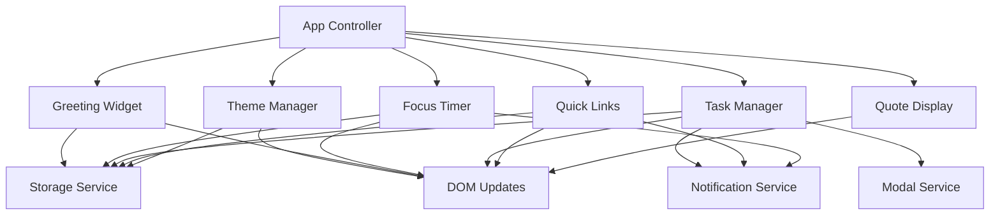
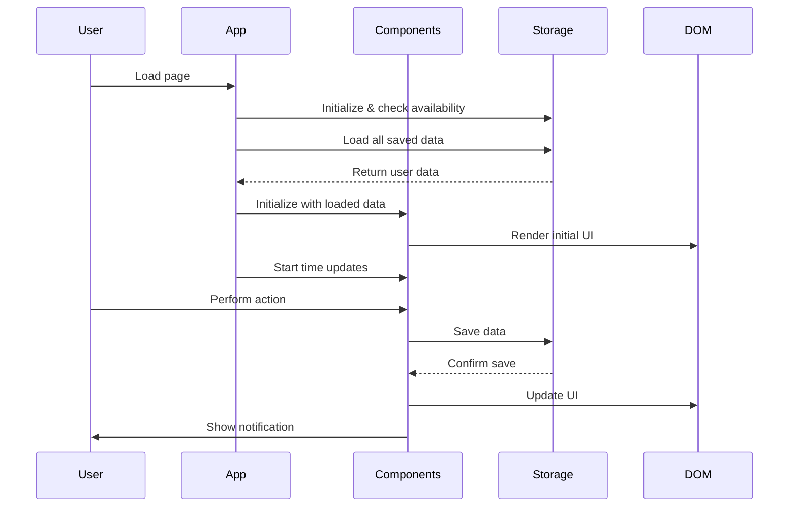

# Design Document: To-Do List Life Dashboard

## Overview

The To-Do List Life Dashboard is a client-side single-page application (SPA) built with vanilla HTML, CSS, and JavaScript. It provides an integrated personal productivity interface combining time awareness, task management, focus timing, and quick navigation capabilities.

### Core Design Principles

1. **Client-Side Only**: All functionality runs in the browser with no server dependencies
2. **Persistent State**: All user data persists in browser Local Storage
3. **Responsive Design**: Fluid layout adapts to desktop, tablet, and mobile screens
4. **Performance First**: Fast initial load (<1s) and instant UI feedback (<100ms)
5. **Accessibility**: Keyboard navigation, semantic HTML, and clear visual feedback
6. **Progressive Enhancement**: Core functionality works even if JavaScript features fail gracefully

### System Architecture

The application follows a component-based architecture where each widget operates independently but shares common services for storage, notifications, and theming.

```
┌─────────────────────────────────────────────────────────────┐
│                     Dashboard Container                      │
│  ┌─────────────────────────────────────────────────────┐   │
│  │              Greeting Widget                         │   │
│  │   (Time, Date, Personalized Greeting)               │   │
│  └─────────────────────────────────────────────────────┘   │
│                                                              │
│  ┌──────────────────┐  ┌───────────────────────────────┐  │
│  │  Focus Timer     │  │   Inspirational Quote         │  │
│  │  (Pomodoro)      │  │                               │  │
│  └──────────────────┘  └───────────────────────────────┘  │
│                                                              │
│  ┌──────────────────────────────────────────────────────┐  │
│  │           Task Manager Component                      │  │
│  │  - Task Input                                         │  │
│  │  - Task List (with completion, edit, delete)         │  │
│  │  - Progress Bar                                       │  │
│  │  - Sort Controls                                      │  │
│  └──────────────────────────────────────────────────────┘  │
│                                                              │
│  ┌──────────────────────────────────────────────────────┐  │
│  │           Quick Links Component                       │  │
│  │  - Link Input                                         │  │
│  │  - Links Grid                                         │  │
│  └──────────────────────────────────────────────────────┘  │
│                                                              │
│  ┌──────────────────────────────────────────────────────┐  │
│  │           Theme Toggle                                │  │
│  └──────────────────────────────────────────────────────┘  │
└─────────────────────────────────────────────────────────────┘


       ┌──────────────────────────────────────────────┐
       │           Shared Services Layer              │
       ├──────────────────────────────────────────────┤
       │  • StorageService (Local Storage wrapper)    │
       │  • NotificationService (Toasts)              │
       │  • ThemeManager (Light/Dark mode)            │
       │  • ModalService (Confirmation dialogs)       │
       └──────────────────────────────────────────────┘
```

## Architecture

### Component-Based Structure

The application is organized into independent, reusable components. Each component manages its own state, DOM rendering, and user interactions while communicating through shared services.

#### Component Hierarchy



### Data Flow Pattern

The application uses a unidirectional data flow pattern:

1. **User Action** → Component Event Handler
2. **Event Handler** → Update Component State
3. **State Update** → Persist to Storage Service
4. **Storage Success** → Re-render UI
5. **UI Update** → Show Notification (if applicable)


### Application Lifecycle



## Components and Interfaces

### 1. StorageService

Central service for all Local Storage operations with error handling and validation.

**Responsibilities:**
- Abstract Local Storage API
- Handle quota exceeded errors
- Validate data before storage
- Provide get/set/remove operations
- Detect storage availability

**Public Methods:**
```javascript
StorageService.isAvailable() → boolean
StorageService.get(key) → any | null
StorageService.set(key, value) → boolean
StorageService.remove(key) → boolean
StorageService.clear() → boolean
```


**Storage Keys:**
- `dashboard_tasks` - Array of task objects
- `dashboard_quicklinks` - Array of quick link objects
- `dashboard_theme` - String ('light' or 'dark')
- `dashboard_username` - String (user's name)
- `dashboard_timer_duration` - Number (seconds)
- `dashboard_task_sort` - String ('creation' | 'alphabetical' | 'completion')

### 2. NotificationService

Manages toast notifications for user feedback.

**Responsibilities:**
- Display temporary notifications
- Auto-dismiss after timeout
- Queue multiple notifications
- Provide success/error/info variants

**Public Methods:**
```javascript
NotificationService.show(message, type, duration) → void
NotificationService.success(message) → void
NotificationService.error(message) → void
NotificationService.info(message) → void
```

**Notification Types:**
- `success` - Green background, checkmark icon
- `error` - Red background, error icon
- `info` - Blue background, info icon


### 3. ModalService

Handles confirmation dialogs and modal overlays.

**Responsibilities:**
- Display modal dialogs
- Handle user confirmation/cancellation
- Manage keyboard events (ESC to close)
- Prevent background interaction

**Public Methods:**
```javascript
ModalService.confirm(message, onConfirm, onCancel) → void
ModalService.close() → void
```

### 4. ThemeManager

Controls application theming and persists user preference.

**Responsibilities:**
- Apply light/dark theme styles
- Toggle between themes
- Persist theme preference
- Apply smooth transitions

**Public Methods:**
```javascript
ThemeManager.init() → void
ThemeManager.toggle() → void
ThemeManager.getCurrentTheme() → string
ThemeManager.setTheme(theme) → void
```

**Implementation:**
- Uses CSS custom properties for theme colors
- Adds/removes `light-theme` class on document body
- Default theme is dark mode


### 5. GreetingWidget

Displays current time, date, and personalized greeting.

**Responsibilities:**
- Display current time (12-hour format with AM/PM)
- Display current date
- Show time-based greeting (Morning/Afternoon/Evening/Night)
- Allow user to set custom name
- Update time every minute

**Public Methods:**
```javascript
GreetingWidget.init() → void
GreetingWidget.updateTime() → void
GreetingWidget.setUserName(name) → void
```

**Time-Based Greetings:**
- Morning: 5:00 AM - 11:59 AM
- Afternoon: 12:00 PM - 5:59 PM
- Evening: 6:00 PM - 11:59 PM
- Night: 12:00 AM - 4:59 AM

### 6. FocusTimer

Pomodoro-style countdown timer for focused work sessions.

**Responsibilities:**
- Start/stop/reset countdown
- Display time in MM:SS format
- Allow custom duration configuration
- Notify when timer completes
- Persist custom duration

**Public Methods:**
```javascript
FocusTimer.init() → void
FocusTimer.start() → void
FocusTimer.stop() → void
FocusTimer.reset() → void
FocusTimer.setDuration(seconds) → void
```

**State Machine:**
- IDLE: Timer not running, shows configured duration
- RUNNING: Timer counting down
- PAUSED: Timer stopped but not reset
- COMPLETE: Timer reached zero


### 7. TaskManager

Manages to-do list operations with full CRUD functionality.

**Responsibilities:**
- Add/edit/delete tasks
- Toggle task completion
- Sort tasks by criteria
- Display progress visualization
- Prevent duplicate tasks
- Persist all changes

**Public Methods:**
```javascript
TaskManager.init() → void
TaskManager.addTask(text) → boolean
TaskManager.editTask(id, newText) → boolean
TaskManager.deleteTask(id) → void
TaskManager.toggleTask(id) → void
TaskManager.sortTasks(criteria) → void
TaskManager.getTasks() → Task[]
TaskManager.getProgress() → { total, completed, percentage }
```

**Sort Criteria:**
- `creation` - Original order added
- `alphabetical` - A-Z by text
- `completion` - Incomplete first, then completed

### 8. QuickLinks

Manages favorite website shortcuts.

**Responsibilities:**
- Add/delete quick links
- Open links in new tabs
- Validate URLs
- Persist all changes
- Display empty state

**Public Methods:**
```javascript
QuickLinks.init() → void
QuickLinks.addLink(name, url) → boolean
QuickLinks.deleteLink(id) → void
QuickLinks.getLinks() → Link[]
```


### 9. QuoteDisplay

Shows inspirational quotes from a local collection.

**Responsibilities:**
- Display random quote on load
- Allow user to request new quote
- Maintain collection of 10+ quotes

**Public Methods:**
```javascript
QuoteDisplay.init() → void
QuoteDisplay.showRandomQuote() → void
```

## Data Models

### Task Model

```typescript
interface Task {
  id: string;              // Unique identifier (timestamp-based)
  text: string;            // Task description
  completed: boolean;      // Completion status
  createdAt: number;       // Unix timestamp
  updatedAt: number;       // Unix timestamp
}
```

**Validation Rules:**
- `id`: Must be unique, generated using Date.now() + random suffix
- `text`: Required, non-empty string, max 500 characters, trimmed
- `completed`: Boolean, defaults to false
- `createdAt`: Set on creation, never changes
- `updatedAt`: Updated on any modification

**Business Rules:**
- Duplicate text values are not allowed
- Tasks are soft-sorted (order stored in array position)
- Maximum 100 tasks recommended for performance


### QuickLink Model

```typescript
interface QuickLink {
  id: string;              // Unique identifier
  name: string;            // Display name
  url: string;             // Website URL
  createdAt: number;       // Unix timestamp
}
```

**Validation Rules:**
- `id`: Must be unique, generated using Date.now() + random suffix
- `name`: Required, 1-50 characters, trimmed
- `url`: Required, valid URL format (http:// or https://)
- `createdAt`: Set on creation

**Business Rules:**
- URLs automatically prefixed with https:// if protocol missing
- Maximum 50 quick links recommended for performance
- Links open in new tab/window (target="_blank")

### Theme Model

```typescript
type Theme = 'light' | 'dark';
```

**Storage:**
- Stored as simple string in Local Storage
- Defaults to 'dark' if not set

### UserSettings Model

```typescript
interface UserSettings {
  name: string;            // User's display name
  timerDuration: number;   // Focus timer duration in seconds
  taskSort: SortCriteria;  // Current sort preference
}

type SortCriteria = 'creation' | 'alphabetical' | 'completion';
```


### Quote Model

```typescript
interface Quote {
  text: string;            // Quote text
  author: string;          // Quote author
}
```

**Collection:**
- Hardcoded array of 10+ quotes
- Selected randomly using Math.random()

## Local Storage Schema

### Storage Structure

```javascript
// All keys use 'dashboard_' prefix to avoid conflicts

localStorage = {
  // Task data
  'dashboard_tasks': '[{"id":"1234","text":"Buy groceries","completed":false,"createdAt":1234567890,"updatedAt":1234567890}]',
  
  // Quick links data
  'dashboard_quicklinks': '[{"id":"5678","name":"Google","url":"https://google.com","createdAt":1234567890}]',
  
  // Theme preference
  'dashboard_theme': 'dark',
  
  // User settings
  'dashboard_username': 'John',
  'dashboard_timer_duration': '1500',  // 25 minutes in seconds
  'dashboard_task_sort': 'creation'
}
```

### Storage Size Estimates

- Single task: ~150 bytes
- 100 tasks: ~15 KB
- Single quick link: ~120 bytes
- 50 quick links: ~6 KB
- Settings: ~100 bytes
- **Total estimated usage: ~21 KB** (well within 5-10 MB limits)


### Data Migration Strategy

For future versions that modify data structures:

1. Version each data structure in storage
2. Check version on load
3. Run migration functions if needed
4. Update version after successful migration

```javascript
// Example versioned structure
{
  version: 1,
  data: [/* actual data */]
}
```

## UI/UX Considerations

### Dark Mode Design

**Color Palette:**
```css
:root {
  /* Dark mode (default) */
  --bg-primary: #1a1a1a;
  --bg-secondary: #2d2d2d;
  --bg-tertiary: #3a3a3a;
  --text-primary: #ffffff;
  --text-secondary: #b0b0b0;
  --accent-primary: #6366f1;
  --accent-hover: #4f46e5;
  --success: #10b981;
  --error: #ef4444;
  --border: #404040;
}

.light-theme {
  /* Light mode */
  --bg-primary: #ffffff;
  --bg-secondary: #f5f5f5;
  --bg-tertiary: #e5e5e5;
  --text-primary: #1a1a1a;
  --text-secondary: #666666;
  --accent-primary: #6366f1;
  --accent-hover: #4f46e5;
  --success: #10b981;
  --error: #ef4444;
  --border: #d4d4d4;
}
```


### Responsive Breakpoints

```css
/* Mobile: 0-767px */
@media (max-width: 767px) {
  /* Single column layout */
  /* Stack all widgets vertically */
  /* Full-width inputs */
}

/* Tablet: 768-1023px */
@media (min-width: 768px) and (max-width: 1023px) {
  /* Two column layout */
  /* Side-by-side widgets where appropriate */
}

/* Desktop: 1024px+ */
@media (min-width: 1024px) {
  /* Multi-column layout */
  /* Maximum width container (1200px) */
  /* Centered content */
}
```

### Typography Scale

```css
/* Based on macOS system fonts */
body {
  font-family: -apple-system, BlinkMacSystemFont, "Segoe UI", Roboto, sans-serif;
  font-size: 16px;
  line-height: 1.5;
}

h1 { font-size: 2.5rem; font-weight: 700; }
h2 { font-size: 2rem; font-weight: 600; }
h3 { font-size: 1.5rem; font-weight: 600; }
p, input, button { font-size: 1rem; }
small { font-size: 0.875rem; }
```


### Animation Specifications

All animations complete within 300ms for perceived performance.

```css
/* Fade in */
@keyframes fadeIn {
  from { opacity: 0; transform: translateY(-10px); }
  to { opacity: 1; transform: translateY(0); }
}

/* Fade out */
@keyframes fadeOut {
  from { opacity: 1; }
  to { opacity: 0; }
}

/* Slide in (toast notifications) */
@keyframes slideIn {
  from { transform: translateX(100%); }
  to { transform: translateX(0); }
}

/* Theme transition */
* {
  transition: background-color 0.3s ease, color 0.3s ease;
}
```

### Interaction States

All interactive elements must have clear hover, focus, and active states:

- **Hover**: Slight color change, cursor pointer
- **Focus**: Visible outline (for keyboard navigation)
- **Active/Pressed**: Slight scale down (0.98)
- **Disabled**: Reduced opacity (0.5), cursor not-allowed

### Empty States

Each component displays helpful empty states:
- Task list: "No tasks yet. Add one to get started!"
- Quick links: "No quick links saved. Add your favorite sites!"
- Timer complete: "Time's up! Take a break."


## Technical Implementation Approach

### Project Structure

```
todo-list-dashboard/
├── index.html              # Main HTML file
├── css/
│   └── styles.css          # All styles in one file
├── js/
│   └── app.js              # All JavaScript in one file
└── assets/
    └── (icons, if needed)
```

### HTML Structure

Semantic HTML5 with clear component boundaries:

```html
<!DOCTYPE html>
<html lang="en">
<head>
  <meta charset="UTF-8">
  <meta name="viewport" content="width=device-width, initial-scale=1.0">
  <title>Life Dashboard</title>
  <link rel="stylesheet" href="css/styles.css">
</head>
<body>
  <div class="container">
    <!-- Greeting Widget -->
    <header class="greeting-widget">
      <div class="time-display"></div>
      <div class="date-display"></div>
      <div class="greeting-message"></div>
    </header>
    
    <!-- Focus Timer & Quote Row -->
    <div class="top-widgets">
      <section class="focus-timer"></section>
      <section class="quote-display"></section>
    </div>
    
    <!-- Task Manager -->
    <section class="task-manager"></section>
    
    <!-- Quick Links -->
    <section class="quick-links"></section>
    
    <!-- Theme Toggle -->
    <button class="theme-toggle" aria-label="Toggle theme"></button>
  </div>
  
  <!-- Toast Container -->
  <div class="toast-container"></div>
  
  <!-- Modal Container -->
  <div class="modal-overlay hidden"></div>
  
  <script src="js/app.js"></script>
</body>
</html>
```


### JavaScript Module Organization

Single file (app.js) organized into logical sections:

```javascript
// ============================================
// SECTION 1: Utility Functions
// ============================================
// - ID generation
// - Date/time formatting
// - URL validation
// - Debounce/throttle helpers

// ============================================
// SECTION 2: Storage Service
// ============================================
const StorageService = { /* ... */ };

// ============================================
// SECTION 3: Notification Service
// ============================================
const NotificationService = { /* ... */ };

// ============================================
// SECTION 4: Modal Service
// ============================================
const ModalService = { /* ... */ };

// ============================================
// SECTION 5: Theme Manager
// ============================================
const ThemeManager = { /* ... */ };

// ============================================
// SECTION 6: Greeting Widget
// ============================================
const GreetingWidget = { /* ... */ };

// ============================================
// SECTION 7: Focus Timer
// ============================================
const FocusTimer = { /* ... */ };

// ============================================
// SECTION 8: Quote Display
// ============================================
const QuoteDisplay = { /* ... */ };

// ============================================
// SECTION 9: Task Manager
// ============================================
const TaskManager = { /* ... */ };

// ============================================
// SECTION 10: Quick Links
// ============================================
const QuickLinks = { /* ... */ };

// ============================================
// SECTION 11: App Initialization
// ============================================
document.addEventListener('DOMContentLoaded', () => {
  // Check storage availability
  // Initialize all components
  // Set up global event listeners
});
```


### Event Handling Strategy

Use event delegation where possible for performance:

```javascript
// Example: Task list with event delegation
taskListElement.addEventListener('click', (e) => {
  const taskItem = e.target.closest('.task-item');
  if (!taskItem) return;
  
  const taskId = taskItem.dataset.taskId;
  
  if (e.target.matches('.task-complete-btn')) {
    TaskManager.toggleTask(taskId);
  } else if (e.target.matches('.task-delete-btn')) {
    TaskManager.deleteTask(taskId);
  } else if (e.target.matches('.task-edit-btn')) {
    TaskManager.editTask(taskId);
  }
});
```

### Performance Optimizations

1. **Debouncing**: Debounce storage writes (100ms) to avoid excessive writes
2. **Batch DOM Updates**: Use DocumentFragment for multiple insertions
3. **Event Delegation**: Single listener per list instead of per item
4. **Lazy Initialization**: Initialize components only when needed
5. **CSS Containment**: Use `contain: layout style` on widgets

### Browser API Usage

- **Local Storage**: Primary persistence mechanism
- **Date API**: For time/date display and timestamps
- **Intersection Observer**: For lazy loading (if needed for future)
- **requestAnimationFrame**: For smooth animations
- **addEventListener**: For all event handling


### State Management Pattern

Each component maintains its own state using closures:

```javascript
const TaskManager = (() => {
  // Private state
  let tasks = [];
  let sortCriteria = 'creation';
  
  // Private methods
  function saveTasks() {
    StorageService.set('dashboard_tasks', tasks);
  }
  
  function renderTasks() {
    // DOM rendering logic
  }
  
  // Public API
  return {
    init() {
      tasks = StorageService.get('dashboard_tasks') || [];
      sortCriteria = StorageService.get('dashboard_task_sort') || 'creation';
      renderTasks();
    },
    
    addTask(text) {
      // Add task logic
      saveTasks();
      renderTasks();
      return true;
    },
    
    // Other public methods...
  };
})();
```

### Error Handling Strategy

1. **Storage Errors**: Catch and notify user if storage fails
2. **Invalid Input**: Validate and show friendly error messages
3. **Missing Elements**: Check DOM elements exist before manipulation
4. **Graceful Degradation**: Core functionality works even if features fail

```javascript
try {
  StorageService.set('dashboard_tasks', tasks);
  NotificationService.success('Tasks saved');
} catch (error) {
  console.error('Storage error:', error);
  NotificationService.error('Failed to save tasks. Storage may be full.');
}
```


## Error Handling

### Error Categories and Responses

#### 1. Storage Errors

**Scenario**: Local Storage unavailable or quota exceeded

**Handling**:
```javascript
if (!StorageService.isAvailable()) {
  NotificationService.error(
    'Storage unavailable. Your data will not be saved.'
  );
  // Continue with in-memory operation
}

try {
  StorageService.set(key, value);
} catch (error) {
  if (error.name === 'QuotaExceededError') {
    NotificationService.error(
      'Storage full. Please delete some items.'
    );
  } else {
    NotificationService.error('Failed to save data.');
  }
}
```

#### 2. Validation Errors

**Scenario**: Invalid user input

**Handling**:
- Display inline error message near input
- Prevent submission
- Clear error on next valid input
- Use red border/text for error state

```javascript
function validateTask(text) {
  if (!text || text.trim().length === 0) {
    return { valid: false, error: 'Task cannot be empty' };
  }
  if (text.length > 500) {
    return { valid: false, error: 'Task too long (max 500 characters)' };
  }
  if (isDuplicate(text)) {
    return { valid: false, error: 'Task already exists' };
  }
  return { valid: true };
}
```


#### 3. DOM Manipulation Errors

**Scenario**: Required DOM element not found

**Handling**:
```javascript
function initComponent() {
  const container = document.querySelector('.component-container');
  if (!container) {
    console.error('Component container not found');
    return false;
  }
  // Continue initialization
  return true;
}
```

#### 4. Timer Errors

**Scenario**: Timer state inconsistencies

**Handling**:
- Reset to idle state on error
- Clear any running intervals
- Notify user and allow restart

#### 5. URL Validation Errors

**Scenario**: Invalid URL in quick links

**Handling**:
```javascript
function isValidUrl(url) {
  try {
    const urlObj = new URL(url.startsWith('http') ? url : `https://${url}`);
    return urlObj.protocol === 'http:' || urlObj.protocol === 'https:';
  } catch {
    return false;
  }
}
```

### Global Error Handler

```javascript
window.addEventListener('error', (event) => {
  console.error('Global error:', event.error);
  NotificationService.error('Something went wrong. Please refresh the page.');
});
```


## Testing Strategy

### Property-Based Testing Assessment

This feature is **NOT suitable for property-based testing** because:

1. **UI Rendering and Layout**: The application is primarily focused on DOM manipulation, visual rendering, and user interface interactions. PBT is not appropriate for testing how elements appear visually or how layouts respond to different screen sizes.

2. **Browser API Side Effects**: Core functionality depends on side-effect operations like Local Storage writes, DOM updates, and timer intervals. These are not pure functions with clear input/output behavior that PBT requires.

3. **User Interaction Workflows**: The application tests user interaction sequences (click, type, submit) which are better suited to example-based integration tests rather than universal properties.

4. **Configuration and State**: Many requirements are about configuration (theme settings, timer duration) and one-time setup, not universal properties that hold across all inputs.

**Appropriate Testing Approach**: Use example-based unit tests, integration tests, and manual testing for this UI-heavy application.

### Testing Approach

Since property-based testing is not applicable, the testing strategy will focus on:

#### 1. Unit Tests (Example-Based)

Test individual component methods with specific examples:

**StorageService Tests:**
- Test get/set/remove operations with valid data
- Test handling of non-existent keys (returns null)
- Test storage availability detection
- Test quota exceeded error handling

**TaskManager Tests:**
- Test adding valid task increases task count
- Test adding duplicate task is prevented
- Test marking task as complete updates status
- Test deleting task removes it from list
- Test sorting by different criteria
- Test progress calculation with various task states
- Test empty list displays empty state


**QuickLinks Tests:**
- Test adding valid link with name and URL
- Test URL validation (with/without protocol)
- Test deleting link removes it
- Test opening link (mock window.open)

**FocusTimer Tests:**
- Test timer starts from configured duration
- Test timer counts down correctly
- Test pause stops countdown
- Test reset returns to initial duration
- Test notification fires when timer completes

**GreetingWidget Tests:**
- Test correct greeting for each time period
- Test time format (12-hour with AM/PM)
- Test custom name display
- Test default greeting without name

**ThemeManager Tests:**
- Test toggle switches between themes
- Test default theme is dark
- Test theme persistence to storage
- Test CSS class application

**NotificationService Tests:**
- Test notification displays with correct message
- Test auto-dismiss after timeout
- Test multiple notifications queue correctly
- Test different notification types (success/error/info)

#### 2. Integration Tests

Test component interactions and workflows:

- Test complete task creation workflow (input → add → save → render)
- Test task deletion with confirmation modal
- Test theme change affects all components
- Test storage failure doesn't break functionality
- Test page load restores all saved data


#### 3. Edge Case Tests

Test boundary conditions and special scenarios:

- Empty task text (whitespace only)
- Maximum length task text (500 characters)
- Task text with special characters and emojis
- Adding 100+ tasks (performance test)
- Adding 50+ quick links (performance test)
- Invalid URLs in quick links
- Storage quota exceeded
- Storage unavailable (private browsing)
- Timer at zero
- Custom timer durations (1 second, 60 minutes)
- Theme switching during animations

#### 4. Responsive Design Testing

Manual testing across breakpoints:

- Desktop (1920x1080, 1366x768)
- Tablet (768x1024)
- Mobile (375x667, 414x896)
- Test all interactions at each breakpoint
- Verify layout doesn't break
- Ensure touch targets are adequate (min 44x44px)

#### 5. Browser Compatibility Testing

Manual testing in:
- Chrome 90+
- Firefox 88+
- Safari 14+
- Edge 90+

Test all core functionality in each browser.


#### 6. Accessibility Testing

Manual testing with:
- Keyboard navigation (Tab, Enter, Escape)
- Screen reader testing (basic functionality)
- Focus indicators visibility
- Color contrast ratios (WCAG AA)
- Alt text for any images/icons

#### 7. Performance Testing

- Measure initial page load time (target: <1s)
- Measure time to interactive
- Test with 100 tasks (should remain responsive)
- Test with 50 quick links (should remain responsive)
- Monitor memory usage over extended session
- Test animation performance (60fps target)

### Testing Tools

Recommended tools for testing:

- **Unit Testing**: Jest or Vitest (for JavaScript testing)
- **DOM Testing**: Testing Library or jsdom
- **Mocking**: Jest mocks for Local Storage, window APIs
- **Performance**: Lighthouse, Chrome DevTools Performance tab
- **Accessibility**: axe DevTools, WAVE browser extension
- **Cross-browser**: BrowserStack or manual testing

### Test Coverage Goals

- **Unit Tests**: 80%+ coverage of business logic
- **Integration Tests**: Cover all major user workflows
- **Edge Cases**: Test all validation and error paths
- **Manual Tests**: Complete coverage of UI/UX requirements

